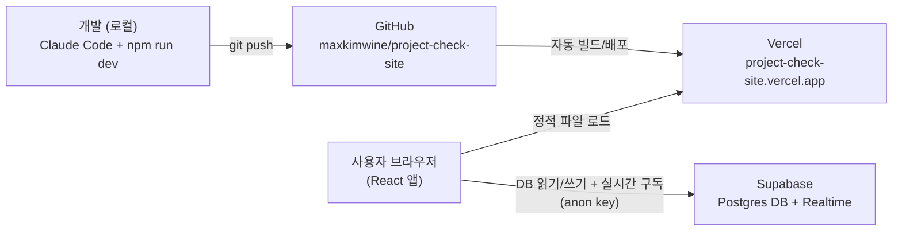

# 사이트 구조 (인프라)

기능 설명은 `사이트 사용법.md`를 참고하세요. 이 문서는 "이 사이트가 어떤 서비스들로,
어떻게 연결되어 돌아가는지"만 정리합니다.

## 한눈에 보는 구조

핵심은: **별도의 백엔드 서버가 없습니다.** 브라우저에서 실행되는 React 앱이 Supabase에
직접 접속해서 데이터를 읽고 씁니다 (Vercel은 정적 파일만 서빙, Supabase가 DB 겸
API 역할).

## 구성요소별 역할

### GitHub — 소스코드 저장소
- 저장소: `maxkimwine/project-check-site`
- 코드/버전 이력을 보관하는 곳. Claude Code가 로컬에서 수정한 내용을 `git push`로
  올리는 대상입니다.
- Vercel이 이 저장소의 `main` 브랜치를 계속 지켜보고 있다가, push가 들어오면 자동으로
  새로 빌드/배포합니다.

### Vercel — 호스팅 + 자동 배포
- 주소: `project-check-site.vercel.app`
- 역할: `main` 브랜치에 push될 때마다 `npm run build`(Vite)로 정적 파일을 만들어
  전세계 CDN에 올려주는 곳. 사용자가 접속하는 주소가 바로 이곳입니다.
- **환경변수 보관**: `VITE_SUPABASE_URL`, `VITE_SUPABASE_ANON_KEY`를 Vercel 프로젝트
  설정(Environment Variables)에 등록해뒀고, 빌드할 때 이 값들이 코드에 심어집니다.
  (로컬 개발 시에는 같은 값을 `.env.local`에 넣어서 씁니다 — 이 파일은 git에는
  올라가지 않음.)
- DB나 로그인 같은 백엔드 로직은 전혀 갖고 있지 않고, 순수하게 "미리 만들어진 웹페이지
  파일을 서빙"만 합니다.

### Supabase — 데이터베이스 + 실시간 기능
- 프로젝트: `Project-check` (Tokyo 리전), `https://pwhvumoajmkfklupoirx.supabase.co`
- 역할: 실질적인 "백엔드" — Postgres DB에 프로젝트/노드/연결선/메모/답글 데이터를
  저장하고, 브라우저가 직접 SQL 대신 Supabase의 REST API로 읽고 씁니다.
- **Realtime**: 두 가지 용도로 사용 중
  - Postgres Changes: 내가 보는 프로젝트를 남이 수정하면 알림 배너를 띄우는 용도
  - Presence: 지금 그 프로젝트를 누가 열어보고 있는지("편집 중" 표시) 추적하는 용도
- **보안(RLS)**: 로그인 기능이 없는 사내용 도구라서, Row Level Security는 켜져 있지만
  "인증 없이 전체 읽기/쓰기 허용" 정책을 명시적으로 걸어뒀습니다. 즉 이 anon key를 아는
  사람은 누구나 모든 데이터를 읽고 쓸 수 있는 구조입니다 (사내 배포용이라 감수한 트레이드오프).
- 테이블/정책 정의는 `supabase/schema.sql`에 있고, Supabase 대시보드 SQL Editor에서
  수동으로 실행해서 적용한 것입니다 (Claude Code는 DB에 직접 접근할 수단이 없음).

### 브라우저 (React 앱)
- Vercel에서 받아온 정적 파일이 브라우저에서 실행되는 것 = 이 사이트의 "앱"입니다.
- 화면에 뭔가 바뀌면(칸 추가, 완료 체크 등) `src/lib/supabaseRepo.ts`를 통해 바로
  Supabase에 씁니다. 별도 서버를 거치지 않고 브라우저 ↔ Supabase가 직접 통신합니다.

## 키 정리 (헷갈리지 않도록)

| 키 종류 | 용도 | 보관 위치 | 노출돼도 되는가 |
|---|---|---|---|
| Publishable(anon) key | 브라우저에서 Supabase 접속 | `.env.local`(로컬), Vercel 환경변수(배포) | 됨 (RLS로만 보호) |
| Secret key | 관리자용 전체 권한 | **어디에도 등록 안 함** | 절대 안 됨 |

## 코드 한 줄 수정이 사이트에 반영되기까지

1. Claude Code(로컬)가 코드 수정 → `git push origin main`
2. GitHub에 push 감지 → Vercel이 자동으로 빌드 시작
3. 빌드 성공 시 `project-check-site.vercel.app`에 새 버전 자동 배포 (보통 1~2분)
4. DB 구조(테이블/정책) 자체를 바꾸는 경우는 이 흐름과 별개로, `supabase/schema.sql`을
   Supabase 대시보드에서 사용자가 직접 실행해야 합니다 (자동 배포 대상이 아님).
